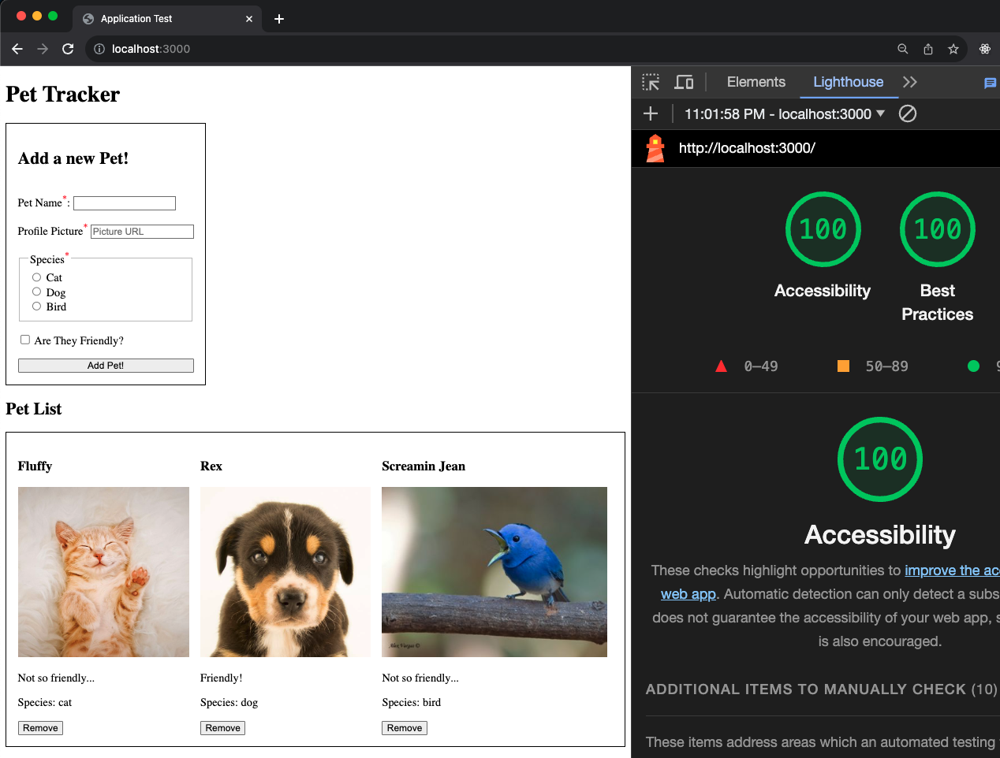

# Pet TrackerSolo Project

- [Pet TrackerSolo Project](#pet-trackersolo-project)
- [Challenge Overview](#challenge-overview)
- [Getting started](#getting-started)
- [Requirements](#requirements)
  - [CSS](#css)
  - [Client Rendering](#client-rendering)
  - [Client Functionality](#client-functionality)
  - [Accessibility](#accessibility)
  - [JSON API](#json-api)
  - [Database](#database)
  - [Stretch Goals](#stretch-goals)

You've learned so much about Express, lets put it to the test! This project will go over the 3 main components of a full-stack application:

- Client
- Server
- Database

We hope you have fun making it!

# Challenge Overview
Your task is to create a "Pet Tracker" application that allows us to:

- See all our existing pets
- Add new pets
- Remove pets

This is a CRUD app without the update functionality. (of course, that's a bonus if you have time!) But basically, if you can do those 3 things, you could probably do the update.



There are more example pictures in the `images` folder of this repo.

# Getting started
Make a brand new repo! This repo here is just a readme and some images. You'll want an express project that has a `public` directory with your frontend assets. To setup Knex and your models, you should check out our [knex getting started template](https://github.com/The-Marcy-Lab-School/7-x-x-resource_knex-getting-started-template) and copy those assets over to your project.

You do not have to deploy your projects, just submit the link to your GitHub repo to canvas (your instructors will have more information on the deadlines).

# Requirements
Here's a list of all the individual requirements that we'd like you to hit for this challenge. What you see is what you get, these are the only aspects we'll be looking at in order to get as much of an apples-to-apples comparison between candidates as possible.

## CSS
The basic CSS is provided for you. We don't want you to worry about it until the primary functionality is completed. To get you off an running, here's the CSS that's already written for you:

```html
<style>
  img { height: 15rem; }
  sup { color: red; }
  form, ul { display: flex; gap: 1rem; padding: 1rem; border: 0.1rem solid #000; }
  form { flex-direction: column; width: fit-content; }
  #pet-list { flex-wrap: wrap; list-style: none; }
</style>
```

After you complete your requirements below, *then* you can add some better CSS. But the point of this project is not to make it look pretty, it's to show us that you can build a full-stack application.

## Client Rendering

- [ ] There is a heading that says "Pet Tracker"
- [ ] There is a form on the page
  - [ ] There is a text input for the pet name
  - [ ] There is a label that says "Pet Name"
  - [ ] There is a text input for the pet profile picture url
  - [ ] There is a label that says "Profile Picture"
  - [ ] The placeholder text for the profile picture input is "Picture URL"
  - [ ] There is a fieldset with a legend of "Species"
  - [ ] There is a radio input with a label of "Dog"
  - [ ] There is a radio input with a label of "Cat"
  - [ ] There is a radio input with a label of "Bird"
  - [ ] There is a checkbox input with a label of "Are they friendly?"
  - [ ] There is a submit button that says "Add Pet!"
  - [ ] The name, profile picture, and species are all HTML required fields
  - [ ] The required fields have an asterisk in their labels
  - [ ] All field values are empty on page load
- [ ] There is another heading that says "Pet List"
- [ ] There is a list of all the pets
  - [ ] Each pet is organized into some kind of a card
  - [ ] Each pet has a name
  - [ ] Each pet has a profile picture
  - [ ] If the pet is friendly, the pet card says "Friendly!", otherwise it says "Not so friendly..."
  - [ ] Each pet has a species formatted like "Species: dog"
  - [ ] Each pet has a "remove" button


## Client Functionality

- [ ] When the form is submitted, the new pet is added to the list
- [ ] The default behavior of the form is prevented
- [ ] You have built out a single fetch utility function
- [ ] The form cannot be submitted if a required field is empty
- [ ] After the form is submitted, the form is cleared
- [ ] When the remove button is clicked, the pet is removed from the list

## Accessibility
At Marcy we are extremely passionate about an open and accessible web. There are some basic accessibility requirements that we'd like you to hit:

- [ ] The `main` tag is used correctly
- [ ] Heading are also in the right order
- [ ] Every label is properly associated with its input
- [ ] Semantic tags are used to properly display all the pets
- [ ] Every pet image has an `alt` attribute with the pet's name

If you *really* want to go the extra mile, run a check with lighthouse and score a 100% or better.


## JSON API

- [ ] Route names are RESTful
- [ ] There is a route that returns all the pets
- [ ] There is a route that adds a new pet
- [ ] There is a route that removes a pet
- [ ] The response of the route that adds a new pet is the new pet data

## Database

- [ ] The data is persisted in a database of some kind
- [ ] There is a query that returns all the pets
- [ ] There is a query that adds a new pet
- [ ] There is a query that removes a pet
- [ ] The response of the query that adds a new pet is the new pet data
- [ ] If necessary, there is a process to build the required DB infrastructure
  - e.g. a query or migration file I can run if you're using SQL

## Stretch Goals
Ok, if you're fully done with the above, let's tackle the update functionality.
The way you should tackle this is with modals! Remember in your fetch project? You would render out a list of things, and when you click it a modal would pop up with more information? Let's copy that pattern!

Add a button called "edit" to each pet card. When you click it, a modal should pop up with all the same inputs as the form. The only difference is that the inputs should be pre-filled with the pet's data. When you submit the form, it should update the pet's data in the database and then close the modal. The modal should also have a "close" button that closes the modal without saving any changes.

- [ ] An edit button has been added to the pet cards
- [ ] clicking the edit button opens a modal
- [ ] The modal has all the same inputs as the form
- [ ] The modal inputs are pre-filled with the pet's data
- [ ] The modal has a "close" button that closes the modal without saving any changes
- [ ] The modal has a "save" button that saves the changes to the pet's data
- [ ] When the modal is closed, the pet re-rendered with the updated data